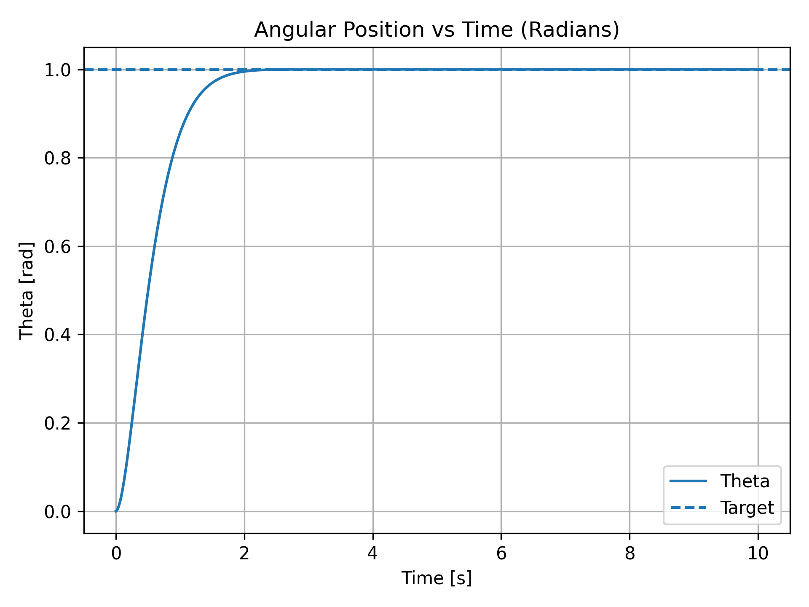
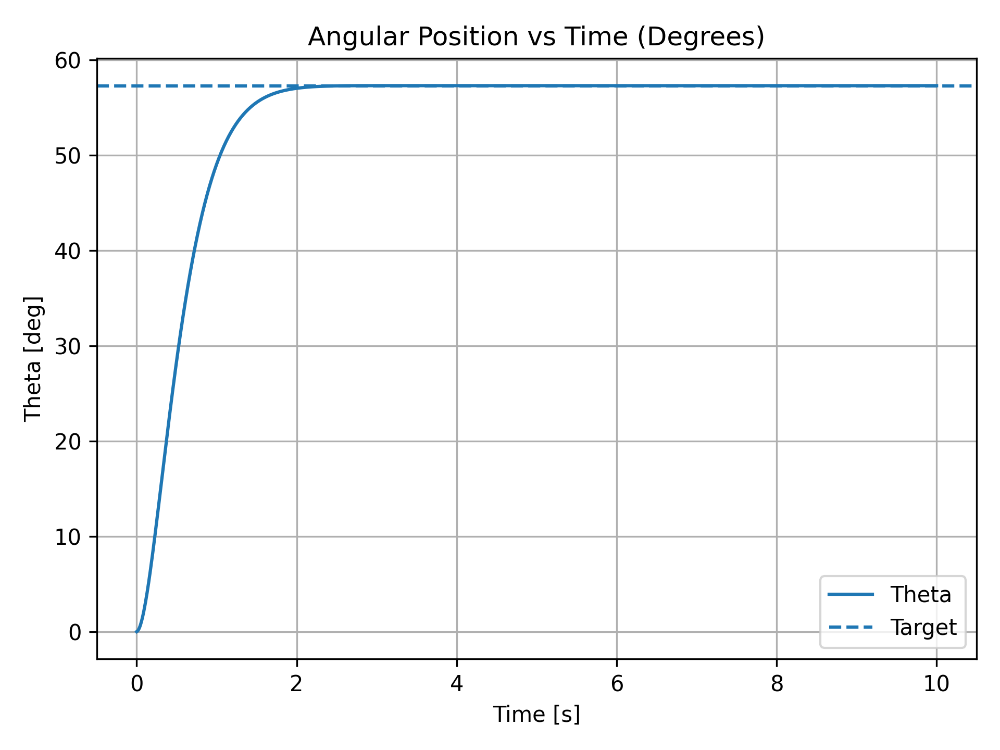
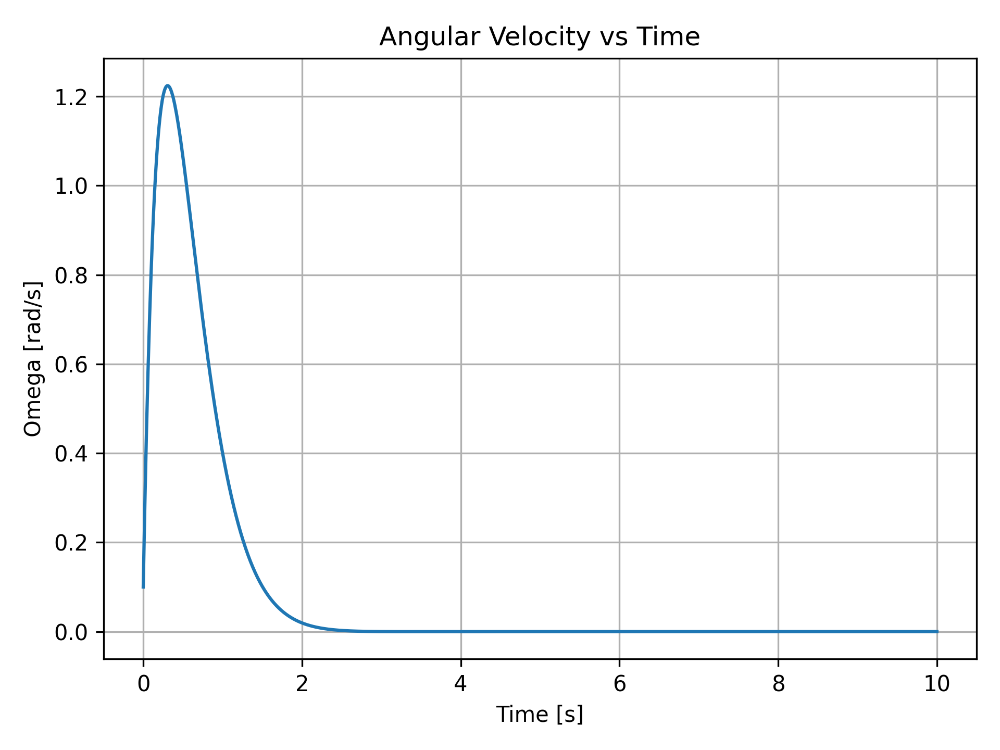
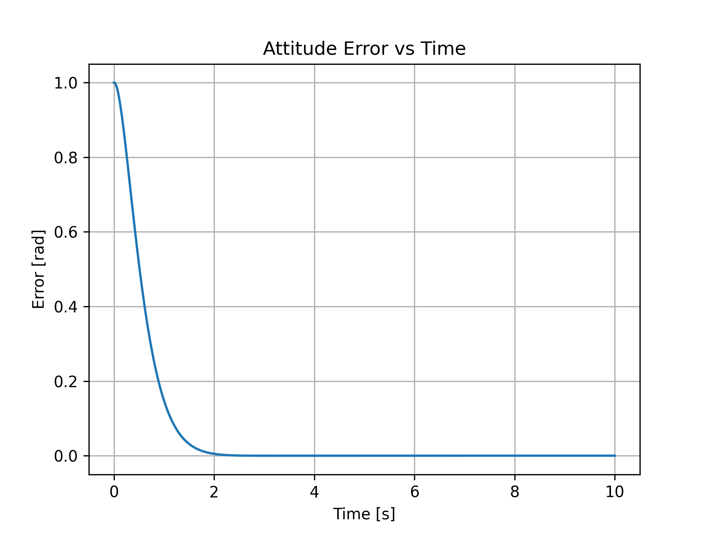
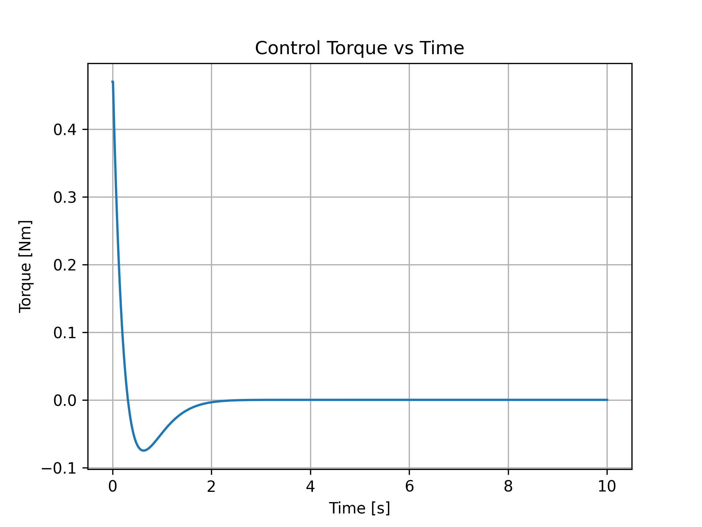

## Satellite Attitude Simulator

This project implements a modular simulation of satellite rotational dynamics (attitude) using a rigid body model and discrete-time numerical integration.

It serves as a foundation for understanding and developing Guidance, Navigation, and Control (GNC) systems.

The simulator is structured to keep configuration, dynamics, simulation flow, and visualization separated, following a clean and scalable engineering approach.

## Current Features
- 1-axis rotational dynamics
- Modular project structure
- Angular position and angular velocity plots

## System Overview

Simulates 1-axis rotational motion of a satellite
Uses Euler integration
Implements:
    Open-loop control
    Proportional (P) control
    Proportional-Derivative (PD) control

## Physical Model

The system follows:

τ = Iα

Where:

τ = torque
I = inertia
α = angular acceleration

## How to Run

bash
pip install -r requirements.txt
python -m src.main

## Outputs

The simulation generates:

Angular position vs time
Angular velocity vs time
Attitude error vs time
Control torque vs time

### Angular Position (Radians)

### Angular Position (Degrees)

### Angular Velocity (Radians/sec)

### Attitude Error

### Control Torque

Torque now goes from fixed to:
τ=Kp​⋅(θtarget​−θ)
Given the P control
